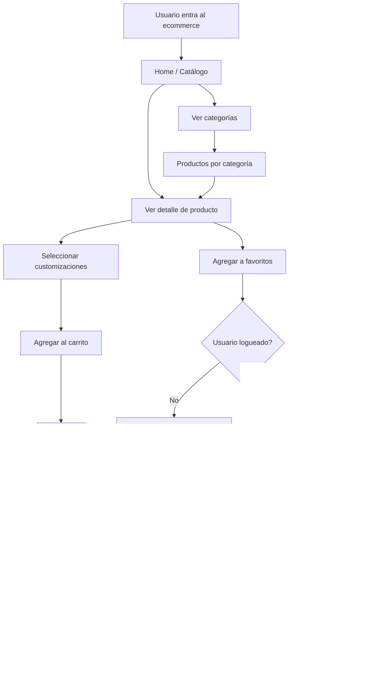
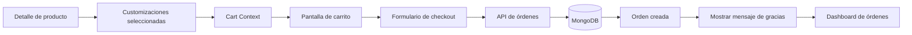
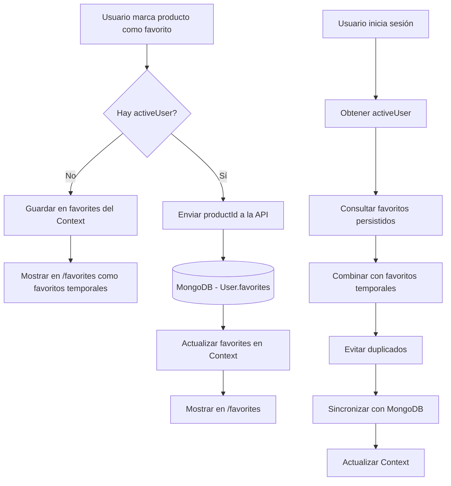
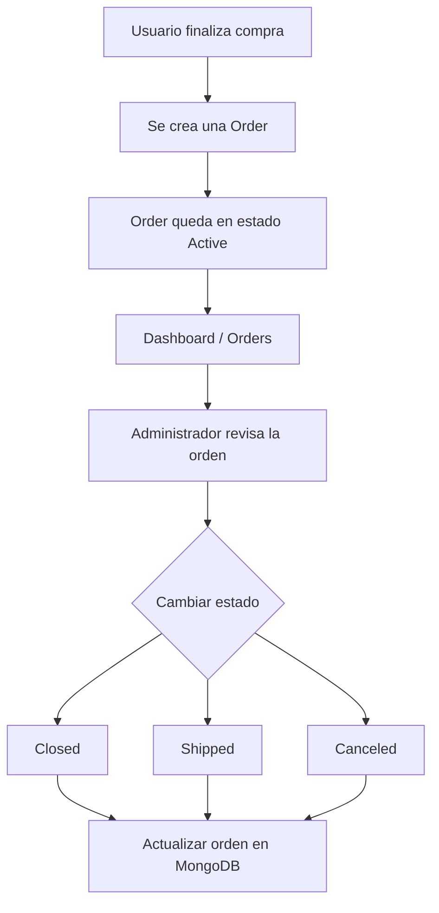

# TP 4: Desarrollo de un Ecommerce con Productos Customizables

## 1. Presentacion

El presente trabajo practico tiene como objetivo desarrollar una aplicacion web de ecommerce utilizando Next.js, MongoDB, Mongoose y TailwindCSS.

La aplicacion debera permitir la publicacion, visualizacion y compra de productos que posean opciones de customizacion. El usuario final podra seleccionar dichas opciones, agregar productos personalizados al carrito, marcar productos como favoritos y finalizar una compra generando una orden en la base de datos.

El proyecto parte de una base inicial con CRUD de productos y categorias. A partir de esta base, cada estudiante debera extender el sistema hasta convertirlo en una aplicacion funcional de ecommerce.

## 2. Objetivo General

Construir un sitio de ecommerce completo que permita administrar productos y categorias, visualizar productos en una tienda publica, customizar productos antes de agregarlos al carrito, registrar usuarios, gestionar favoritos y generar ordenes de compra persistidas en MongoDB.

## 3. Objetivos Especificos

El estudiante debera:

- Implementar productos con opciones de customizacion.
- Crear pantallas publicas de catalogo, categorias y detalle de producto.
- Implementar un carrito de compras usando Context API.
- Gestionar productos favoritos del usuario.
- Crear la entidad usuario y permitir registro/login.
- Mantener un usuario activo en el estado global de la aplicacion.
- Crear la entidad order y persistir compras en la base de datos.
- Generar numeros secuenciales para las ordenes.
- Implementar una pantalla de checkout.
- Aplicar un diseño moderno y responsive con TailwindCSS.
- Organizar correctamente rutas, modelos, componentes, librerias y acciones del proyecto.

## 4. Descripcion Funcional

El ecommerce debe permitir que un usuario navegue productos, vea el detalle de cada uno y seleccione distintas opciones de customizacion antes de comprar.

Por ejemplo, si la tienda vende cookies, un producto podria tener las siguientes opciones:

- Tipo de masa: vainilla, chocolate, red velvet.
- Topping: glasé, dulce de leche, crema.
- Chips: chocolate blanco, chocolate negro, frutos secos.

El usuario debera poder elegir una combinacion de opciones y agregar al carrito la cantidad de unidades que desee. Si agrega el mismo producto con otra combinacion de opciones, debera registrarse como un item distinto dentro del carrito.

## 5. Requerimientos Obligatorios

### 5.1 Productos

**Entidad**

Se debe trabajar con la entidad `Product`.

Cada producto debe incluir, como minimo:

- Nombre.
- Descripcion.
- Precio.
- Stock.
- Imagen.
- Categorias.
- Opciones o atributos de customizacion.

**Relaciones**

- Un producto puede pertenecer a muchas categorias.
- La relacion con categorias debe guardarse mediante IDs de categorias.
- No se contemplan subcategorias.

**Imagenes**

- Las imagenes deben almacenarse en `public/images/products/`.
- En la base de datos se debe guardar solamente el nombre del archivo.
- No se deben guardar URLs externas como requisito principal.

Ejemplo:

```json
{
  "image": "imagen01.jpg"
}
```

Luego, en la aplicacion, la imagen debe referenciarse como:

```bash
/images/products/imagen01.jpg
```

**Funciones**

Se debe implementar la funcion:

```js
getProduct(id)
```

Esta funcion debera obtener un producto por su ID y ser utilizada en la pantalla de detalle del producto.

**API**

Se deben crear o completar las rutas de API necesarias para:

- Listar productos.
- Obtener un producto por ID.
- Crear productos.
- Editar productos.
- Eliminar productos.

**Pantalla**

Se debe crear la ruta:

```bash
/product/[id]
```

La pantalla de producto debe mostrar:

- Foto del producto.
- Titulo.
- Descripcion.
- Precio.
- Stock disponible.
- Categorias asociadas.
- Atributos u opciones de customizacion.
- Selector de cantidad.
- Boton para agregar al carrito.
- Boton para agregar o quitar de favoritos.
- Productos relacionados por categoria.

Los productos relacionados deben obtenerse a partir de alguna categoria compartida con el producto actual.

### 5.2 Categorias (Resuelto a modo de ejemplo)

**Entidad**

Se debe trabajar con la entidad `Category`.

Cada categoria debe incluir, como minimo:

- Nombre.
- Descripcion.

**Relaciones**

- Una categoria puede estar asociada a muchos productos.
- Un producto puede estar asociado a muchas categorias.
- La relacion se resuelve desde el producto guardando IDs de categorias.
- No se contemplan subcategorias.

**Pantallas**

La ruta publica de categorias debe incluir:

```bash
/categories
/category/[id]
```

La pantalla `/categories` debe listar las categorias disponibles.

La pantalla `/category/[id]` debe listar los productos pertenecientes a esa categoria.

**CRUD**

La aplicacion debe permitir:

- Crear categorias.
- Listar categorias.
- Editar categorias.
- Eliminar categorias.
- Asociar productos a una o varias categorias.
- Ver productos pertenecientes a una categoria.

**API**

Se deben crear o completar las rutas de API necesarias para:

- Listar categorias.
- Obtener una categoria por ID.
- Crear categorias.
- Editar categorias.
- Eliminar categorias.

### 5.3 Favoritos (CLIENT SIDE)

**Estado**

Los favoritos deben guardarse en el estado `favorites` del context global.

**Relacion con usuarios y productos**

- Si el usuario no inicio sesion, los favoritos se guardan temporalmente en el context.
- Si el usuario esta logueado, los favoritos deben sincronizarse con la base de datos.
- En la base de datos se deben almacenar solamente los IDs de los productos favoritos.
- Los favoritos persistidos deben estar asociados al usuario.

Ejemplo de campo en el modelo `User`:

```js
favorites: [
  {
    type: mongoose.Schema.Types.ObjectId,
    ref: "Product",
  },
]
```

La API puede devolver los productos completos usando `populate` para facilitar el renderizado de la pantalla `/favorites`.

Ejemplo de consulta en la API:

```js
const user = await User.findById(userId).populate("favorites");

return Response.json({
  favorites: user.favorites,
});
```

Referencia recomendada: documentacion oficial de Mongoose sobre `populate`: https://mongoosejs.com/docs/populate.html

**Pantalla**

Se debe crear la ruta:

```bash
/favorites
```

Esta pantalla debe implementarse del lado cliente cuando utilice `activeUser` o `favorites` desde el context. La informacion persistida debe obtenerse llamando a las API routes mediante `fetch` o `axios`; no se debe depender de una consulta directa server-side para saber que usuario esta activo, porque ese dato vive en el context del cliente.

La pantalla de favoritos debe mostrar el listado de productos favoritos disponibles en el context.

Si el usuario no inicio sesion, se mostraran los favoritos temporales. Si el usuario esta logueado, se mostraran los favoritos sincronizados con la base de datos.

La pantalla de favoritos debe permitir:

- Visualizar los productos guardados como favoritos.
- Acceder al detalle de cada producto.
- Quitar productos de favoritos.
- Mostrar un mensaje claro si el usuario no tiene favoritos cargados.

**API sugerida**

```bash
GET /api/users/[userId]/favorites
POST /api/users/[userId]/favorites
DELETE /api/users/[userId]/favorites/[productId]
PUT /api/users/[userId]/favorites/sync
```

Uso esperado de cada endpoint:

- `GET /api/users/[userId]/favorites`: obtiene los favoritos del usuario desde la base de datos.
- `POST /api/users/[userId]/favorites`: agrega un producto a favoritos. El body puede incluir `{ "productId": "..." }`.
- `DELETE /api/users/[userId]/favorites/[productId]`: quita un producto de favoritos.
- `PUT /api/users/[userId]/favorites/sync`: recibe un array de IDs de productos favoritos y lo sincroniza con los favoritos existentes del usuario, evitando duplicados.

**Comportamiento**

- Cuando un producto se agrega a favoritos, debe actualizarse el estado `favorites` del context.
- Cuando un producto se agrega a favoritos y hay usuario logueado, debe guardarse en la base de datos.
- Cuando un producto se quita de favoritos, debe actualizarse el estado `favorites` del context.
- Cuando un producto se quita de favoritos y hay usuario logueado, debe quitarse de la base de datos.
- Si el usuario no inicio sesion, puede marcar favoritos temporalmente en el context.
- Cuando el usuario inicia sesion, se deben obtener sus favoritos persistidos, combinarlos con los favoritos temporales, evitar duplicados, sincronizar con MongoDB y actualizar el context.

La carga de favoritos persistidos debe realizarse desde el cliente, usando el ID disponible en `activeUser` y haciendo un request a la API route correspondiente con `fetch` o `axios`.

### 5.4 Carrito (CLIENT SIDE)

**Estado**

El carrito debe guardarse en el estado `cart` del context global.

Cada item del carrito debe incluir, como minimo:

- ID del producto.
- Nombre del producto.
- Imagen.
- Precio unitario.
- Cantidad.
- Customizaciones seleccionadas.
- Subtotal.

**Relacion con productos**

- El carrito puede referenciar el ID del producto original.
- Ademas del ID, debe conservar los datos necesarios para mostrar el item correctamente.
- Dos productos con el mismo ID pero con distintas opciones elegidas deben considerarse items distintos.

**Pantalla**

Se debe crear la ruta:

```bash
/cart
```

Esta pantalla debe implementarse del lado cliente porque depende del estado `cart` del context global.

La pantalla del carrito debe mostrar:

- Productos agregados.
- Imagen o referencia visual del producto.
- Nombre del producto.
- Customizaciones seleccionadas.
- Precio unitario.
- Cantidad.
- Subtotal por item.
- Total general.

**Acciones**

Desde el carrito, el usuario debe poder:

- Incrementar o disminuir cantidades.
- Eliminar productos.
- Continuar al checkout.

### 5.5 Checkout (CLIENT SIDE)

**Pantalla**

Se debe crear la ruta:

```bash
/checkout
```

Esta pantalla debe implementarse del lado cliente cuando tome datos desde `cart` o `activeUser` del context global.

La pantalla de checkout debe incluir un formulario para finalizar la compra.

El formulario debe permitir cargar o confirmar:

- Datos del usuario.
- Datos de contacto.
- Direccion o informacion necesaria para la entrega.
- Observaciones de la compra, si fueran necesarias.
- Opciones de envio, en caso de implementarse.

**Relacion con carrito, usuario y orden**

- El checkout toma los items del `cart`.
- Si hay usuario logueado, la orden debe asociarse a `activeUser`.
- La order creada debe guardar el snapshot de productos comprados.
- La order creada debe guardar los datos necesarios del usuario comprador.

**Comportamiento**

Al enviar el formulario:

- Se debe crear una order en la base de datos.
- Se debe guardar el detalle completo del carrito.
- Se debe calcular y guardar el total.
- Se debe asignar un numero secuencial de orden.
- Se debe mostrar un mensaje de agradecimiento o confirmacion de compra, idealmente incluyendo el numero de orden generado.
- Se debe limpiar el carrito si la orden fue creada correctamente.

**API**

Se debe crear una ruta de API para generar la orden.

Ejemplo sugerido:

```bash
POST /api/orders
```

### 5.6 Ordenes de Compra

**Entidad**

Se debe crear la entidad `Order`.

Cada orden debe incluir:

- ID de MongoDB.
- Numero secuencial de orden.
- Fecha de creacion.
- Estado de la orden.
- Datos del usuario que realizo la compra.
- Detalle de productos comprados.
- Customizaciones elegidas por cada producto.
- Cantidades.
- Precios unitarios.
- Subtotales.
- Total de la orden.

**Relaciones**

- Una orden pertenece a un usuario.
- La orden debe guardar los datos del usuario que compro.
- La orden debe guardar un array de productos comprados.

**Snapshot de productos**

El detalle de productos de una orden no debe guardar solamente el ID del producto. La orden debe guardar un snapshot de los datos necesarios para reconstruir la compra aunque luego el producto sea editado o eliminado.

Cada item dentro del array de productos de la orden debe incluir, como minimo:

- ID del producto.
- Nombre del producto.
- Foto o nombre de imagen.
- Precio unitario al momento de la compra.
- Cantidad comprada.
- Customizaciones seleccionadas.
- Subtotal del item.

**Numero secuencial**

El numero de orden debe ser secuencial.

Ejemplo:

```bash
Order Nro 1000
Order Nro 1001
Order Nro 1002
```

La numeracion puede implementarse mediante una coleccion auxiliar, un contador o cualquier estrategia consistente que garantice el incremento correcto.

**Estados**

Las ordenes deben manejar cuatro estados posibles:

- `Active`: orden recibida y pendiente de procesamiento.
- `Closed`: orden finalizada.
- `Shipped`: orden enviada.
- `Canceled`: orden cancelada.

El estado de la orden debe poder modificarse desde las pantallas administrativas correspondientes.

**Pantallas relacionadas**

- `/user`: listado de ordenes del usuario activo.
- `/user/order/[id]`: detalle de orden visible para el usuario, solo lectura.
- `/dashboard/orders`: listado administrativo de todas las ordenes.
- `/dashboard/order/[id]`: detalle administrativo de orden con cambio de estado.

**API**

Se deben crear las rutas de API necesarias para:

- Crear ordenes.
- Listar ordenes.
- Listar ordenes de un usuario.
- Obtener una orden por ID.
- Cambiar el estado de una orden desde el dashboard.

### 5.7 Usuarios

**Entidad**

Se debe crear la entidad `User`.

El modelo de usuario debe incluir, como minimo:

- Nombre.
- Email.
- Password o campo equivalente segun la estrategia implementada.
- Productos favoritos.
- Fecha de creacion.

**Relaciones**

- Un usuario puede tener muchos productos favoritos.
- Un usuario puede tener muchas ordenes.
- Los favoritos se guardan como IDs de productos.
- Las ordenes deben asociarse al usuario que realizo la compra.

**Comportamiento**

- El usuario debe poder registrarse.
- El registro debe crear un documento en la base de datos.
- El usuario debe poder iniciar sesion.
- Al hacer login, se deben obtener los datos del usuario desde la base de datos.
- El usuario logueado debe quedar almacenado como `activeUser` en el context global.

No es obligatorio implementar autenticacion avanzada, pero si debe existir persistencia real del usuario en MongoDB.

**API**

Se deben crear las rutas de API necesarias para:

- Registrar usuarios.
- Hacer login.
- Obtener un usuario por ID.
- Obtener los datos del usuario activo cuando corresponda.

### 5.8 Panel del Usuario (CLIENT SIDE)

**Entidad relacionada**

Esta seccion depende de `User` y `Order`.

**Relaciones**

- Se deben listar solamente las ordenes asociadas al usuario activo.
- Cada orden debe estar relacionada con el usuario que realizo la compra.

**Pantalla**

Se debe crear la ruta:

```bash
/user
```

Como esta pantalla depende del usuario activo guardado en el context, la carga de las ordenes del usuario debe hacerse del lado cliente. Se debe tomar el ID desde `activeUser` y consultar una API route con `fetch` o `axios`.

La pantalla `/user` debe mostrar, como minimo:

- Datos principales del usuario activo.
- Listado de ordenes realizadas por ese usuario.
- Numero de orden.
- Fecha.
- Total.
- Estado actual de cada orden.
- Link para acceder al detalle de cada orden.

Tambien se debe crear una pantalla de detalle de orden para el usuario:

```bash
/user/order/[id]
```

Esta pantalla tambien debe validar desde el lado cliente el usuario activo y pedir el detalle de la orden a la API route correspondiente. La API debe asegurar que la orden solicitada pertenezca al usuario indicado.

Esta pantalla debe mostrar:

- Numero de orden.
- Fecha.
- Estado.
- Datos de contacto o envio cargados en checkout.
- Productos comprados.
- Customizaciones seleccionadas.
- Cantidades.
- Precios unitarios.
- Subtotales.
- Total final.

**Permisos**

- Esta pantalla es de solo lectura para el usuario.
- No debe permitir cambiar el estado de la orden ni modificar sus datos.
- El usuario solo debe poder visualizar sus propias ordenes.

**API sugerida**

```bash
GET /api/users/[userId]/orders
GET /api/users/[userId]/orders/[orderId]
```

Estas rutas deben devolver solamente ordenes asociadas al usuario indicado.

El consumo de estas rutas debe realizarse desde componentes cliente usando el ID disponible en `activeUser`.

### 5.9 Dashboard (ADMIN)

**Pantallas**

Se debe reformular la ruta:

```bash
/dashboard
```

Esta pantalla debe funcionar como resumen administrativo del ecommerce y mostrar, como minimo:

- Ultimas 5 ordenes recibidas.
- Total vendido en el mes.
- Ultimos 5 usuarios registrados.
- Productos con stock bajo, considerando stock `1` o `0`.
- Accesos o links hacia las secciones principales de administracion.

La administracion actual de productos y categorias debe moverse a:

```bash
/dashboard/products
```

Esta pantalla debe permitir:

- Crear productos.
- Editar productos.
- Eliminar productos.
- Crear categorias.
- Editar categorias.
- Eliminar categorias.
- Asociar categorias a productos.

Tambien se debe crear:

```bash
/dashboard/orders
/dashboard/order/[id]
```

La pantalla `/dashboard/orders` debe listar todas las ordenes recibidas y permitir cambiar el estado de cada orden entre:

- `Active`
- `Closed`
- `Shipped`
- `Canceled`

La pantalla `/dashboard/order/[id]` corresponde al administrador. Debe mostrar el detalle completo de la orden, la informacion del usuario comprador y permitir cambiar el estado de la orden.

**Relaciones**

- El dashboard trabaja con productos, categorias, usuarios y ordenes.
- El detalle administrativo de una orden debe obtener la informacion del usuario desde la entidad `User`.
- Las ordenes listadas deben usar la entidad `Order`.

**Componentes**

Se recomienda reutilizar el componente de visualizacion del detalle de la orden entre `/user/order/[id]` y `/dashboard/order/[id]`, mostrando acciones distintas segun el contexto.

El componente utilizado para cambiar el estado de una orden debe reutilizarse tanto en `/dashboard/orders` como en `/dashboard/order/[id]`.

**API**

Se deben crear las rutas de API necesarias para:

- Obtener metricas o datos de resumen para `/dashboard`.
- Listar ordenes para `/dashboard/orders`.
- Obtener una orden por ID para `/dashboard/order/[id]`.
- Cambiar el estado de una orden.
- Obtener productos con stock bajo.

Las pantallas administrativas del dashboard no dependen del `activeUser` del comprador para listar ordenes. Pueden obtener datos desde Server Components, Server Actions o desde componentes cliente consumiendo API routes, segun el enfoque elegido.

### 5.10 Context Global de la Aplicacion

**Context**

Se debe crear un context global para administrar el estado principal de la aplicacion.

El context debe incluir, como minimo, tres estados:

- `cart`: listado de productos agregados al carrito.
- `favorites`: listado de productos favoritos. Si el usuario no inicio sesion, se mantienen temporalmente en el context. Si el usuario esta logueado, deben sincronizarse con la base de datos.
- `activeUser`: datos del usuario activo luego del login.

**Funciones del context**

El context debe proveer funciones para:

- Agregar productos al carrito.
- Quitar productos del carrito.
- Cambiar cantidades.
- Vaciar el carrito.
- Agregar productos a favoritos.
- Quitar productos de favoritos.
- Guardar el usuario activo.
- Cerrar sesion o limpiar el usuario activo.

**Carga de datos dependientes del usuario**

Como `activeUser` vive en el context de la aplicacion, las consultas que dependan del usuario activo deben realizarse desde el lado cliente.

Por ejemplo, una vez que el usuario hizo login y `activeUser` tiene su ID, se debe hacer un `fetch` desde un componente cliente o desde una funcion del context para traer informacion asociada a ese usuario, como sus favoritos.

## 6. Rutas Obligatorias

La aplicacion debe contar con las siguientes rutas, separadas por tipo de uso.

**Pantallas publicas**

```bash
/
/categories
/category/[id]
/product/[id]
```

**Pantallas del usuario / client-side**

Estas pantallas dependen del context global (`cart`, `favorites`, `activeUser`) y deben consumir API routes con `fetch` o `axios` cuando necesiten datos persistidos.

```bash
/cart
/favorites
/checkout
/user
/user/order/[id]
```

**Pantallas del dashboard / admin**

Estas pantallas corresponden a la administracion del ecommerce.

```bash
/dashboard
/dashboard/products
/dashboard/orders
/dashboard/order/[id]
```

## 7. Diseño e Interfaz

El proyecto debe implementar un diseño moderno utilizando TailwindCSS.

Se evaluara:

- Consistencia visual.
- Claridad en la navegacion.
- Correcta jerarquia de informacion.
- Diseño responsive.
- Buen uso de espaciados, colores, tipografias y estados interactivos.
- Separacion entre pantallas publicas y pantallas de administracion.

La aplicacion debe contar con una navegacion principal que permita acceder a las secciones mas importantes.

## 8. Opcionales

Los siguientes puntos son opcionales y suman valor al trabajo. **Se deberán elegir al menos 3 del listado e implementarlos**.

- Usar servicios como SendGrid, MailJS, Nodemailer u otros para integrar envio de emails al confirmar una compra. Se envia mail al usuario y al shop owner
- Agregar opciones de envio.
- Agregar simulación de pago con tarjeta o medios de pago
- Agregar busqueda de productos.
- Agregar filtros por categoria y precio.
- Agregar filtros, busqueda o paginacion dentro del historial de ordenes del usuario.
- Agregar graficos en el dashboard.
- Hostear las imagenes en Vercel Blob u otro servicio similar como mejora opcional, manteniendo documentado cómo se resuelven las imagenes y sin romper el requisito base de imagenes locales.
- Realizar autenticacion del usuario mediante JWT, encriptando el password en el servidor.
- Agregar middleware de autorización para páginas privadas o públicas. Ej: Solo un usuario admin puede loguearse y ver el dashboard; Cada usuario puede ver solo su dashboard.
- Integrar etiquetas meta dinámicas para SEO: Meta tags, OG, sitemap dinámico.

## 9. Configuracion del Proyecto

Crear un archivo `.env` basado en `env.example` y configurar la conexion a MongoDB.

Ejemplo:

```bash
MONGODB_URI=mongodb://127.0.0.1:27017/ecommerce-clase
```

Instalar dependencias:

```bash
npm install
```

Ejecutar el proyecto:

```bash
npm run dev
```

Abrir en el navegador:

```bash
http://localhost:3000
```

## 10. Criterios de Evaluacion

Se evaluara:

- Correcta implementacion de modelos en MongoDB/Mongoose.
- Funcionamiento de las rutas publicas y privadas solicitadas.
- Correcto uso del context global.
- Persistencia de usuarios, favoritos y ordenes.
- Funcionamiento de la pantalla de favoritos.
- Funcionamiento del panel de usuario y detalle de sus ordenes.
- Funcionamiento del carrito con productos customizados.
- Creacion correcta de orders con numero secuencial.
- Correcto guardado del snapshot de productos dentro de cada orden.
- Mensaje de agradecimiento o confirmacion visible luego de crear una orden.
- Implementacion del dashboard administrativo con resumen, listado de ordenes y cambio de estado.
- Calidad del diseño implementado con TailwindCSS.
- Organizacion del codigo.
- Claridad de componentes, funciones y estructura de carpetas.
- Manejo adecuado de estados y formularios.
- Navegabilidad general de la aplicacion.

## 11. Entrega

El proyecto debe entregarse funcionando localmente.

La entrega debe incluir:

- Codigo fuente completo (Github).
- Link público a la app en Vercel.
- Modelos, rutas y pantallas solicitadas.
- Datos de prueba cargados.
- Productos con imagenes locales.
- Al menos un usuario de prueba.
- Al menos una orden generada correctamente.
- Instrucciones para ejecutar el proyecto.
- Consentimiento sobre el uso de la IA.
- Reflexión sobre el uso de la IA.

Todas las rutas principales deben ser accesibles desde la interfaz de usuario.

Cualquier propuesta superadora será tomada en cuenta.

## 12 Diagramas de flujo

## 12.1 Flujo general de navegación

El siguiente diagrama representa el recorrido principal que puede realizar un usuario dentro del ecommerce, desde el ingreso al sitio hasta la finalización de una compra.



## 12.2 Flujo de información del carrito y checkout

El siguiente diagrama muestra cómo circula la información desde la pantalla de detalle del producto hasta la creación de una orden de compra en la base de datos.



## 12.3 Flujo de favoritos

El siguiente diagrama representa el comportamiento esperado de los productos favoritos, contemplando usuarios no logueados y usuarios logueados.



## 12.4 Flujo de administración de órdenes

El siguiente diagrama muestra el recorrido de una orden desde que es generada por el usuario hasta que es gestionada desde el dashboard administrativo.




---------

**Welcome to the e-machine**
